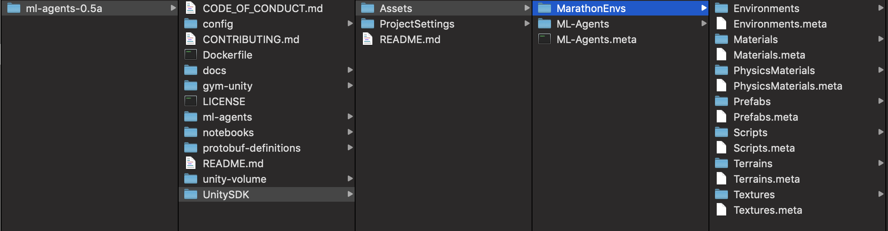

## TL;DR
* TODO add download link!

## About MarathonEnvs

## Setting up your development repository

* Ensure you have Unity 2017.4 or above

1. download ML-Agents Beta 0.5.0a ([GitHub](https://github.com/Unity-Technologies/ml-agents/releases/tag/0.5.0a)) ([zip](https://github.com/Unity-Technologies/ml-agents/archive/0.5.0a.zip))
   * Unzip `ml-agents-0.5a` to your `Development` folder 
   
1. download MarathonEnvs 0.5.0a ([GitHub](https://github.com/Unity-Technologies/marathon-envs/releases/tag/0.5.0a)) ([zip](https://github.com/Unity-Technologies/marathon-envs/archive/0.5.0a.zip))
   * Unzip `⁨marathon-envs-0.5.0a⁩`
   * Copy `⁨marathon-envs-0.5.0a⁩/config/marathon_envs_config.yaml` to `ml-agents-0.5a⁩/config⁩`
   
   * Copy `⁨marathon-envs-0.5.0a⁩/MarathonEnvs` to `Development⁩/ml-agents-0.5a/UnitySDK/Assets/⁩`
   
1. download TFSharpPlugin ([zip](https://s3.amazonaws.com/unity-ml-agents/0.5/TFSharpPlugin.unitypackage))

 
1. an ordered
1. list
 
 
* install tensorflowsharp
* set up pythons
* open Unity
* run walker

# Training hopper
* switching to training mode

* Training the walker
* Training the ant
* Training the humanoid

 * Reward Function
 * Termination
 * Observations
